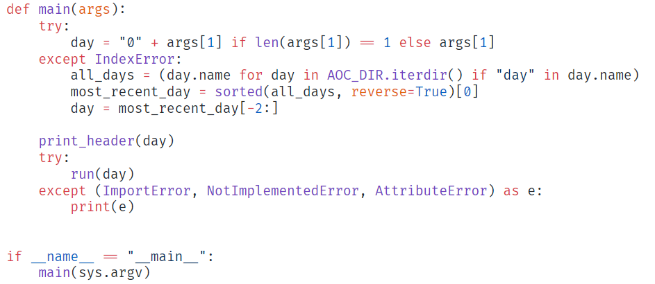
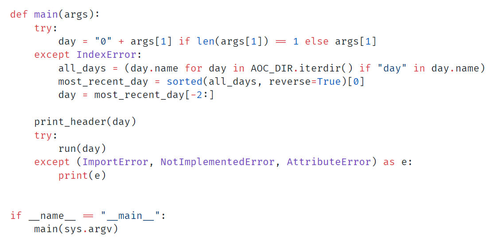
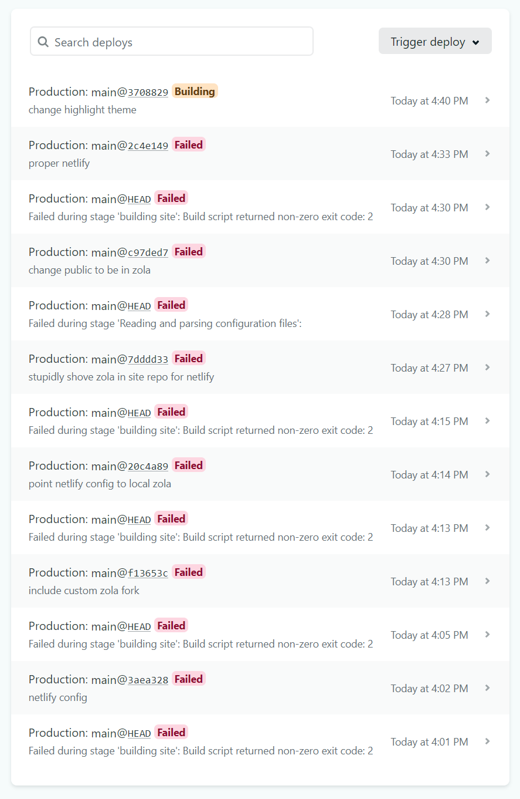

I
[recently](https://github.com/Starchery/personal-site/pull/3)
went through the arduous task of
setting this site up to use
[hugo](https://gohugo.io)
for static site generation.
<!--more-->
You probably didn't notice much
different—the frontend is pretty much the same.

I was using
[zola](https://getzola.org)
previously,
and was very happy with it.
Very few complaints,
and in many ways I prefer it to Hugo.
I was just running into a lot of small problems with it,
and I feared that I was boxing myself in using a SSG with suboptimal tooling.

I wanted to spend some time comparing the two
and discussing why I ended up going with Hugo.

## my use-case

I don't need many features from a SSG,
but it's important that the ones I need are *really* robust.
That means, the following things should be so trivial that I don't have to think about it:

* writing new posts
* formatting code blocks with syntax highlighting
* **fast** rendering and page loads
* trivial Sass support
* ...

I'm sitting here racking my brain trying to think of something else,
but I got nothing. That's all I need.

## zola

Zola is a SSG written in Rust.
It uses the
[tera](https://tera.netlify.app/)
templating engine and the
[syntect](https://crates.io/crates/syntect)
library for syntax highlighting.

Tera is great, but I could never quite get the hang of it.
I hate all templating engines, honestly.
They all feel like arcane, lawless hacks hacked on top of more hacks.
Their existence does not feel truly justified to me.
Nothing personal, Tera.


I think JSX and functional
[react](https://reactjs.org/)
components are the future in this area.
Or more accurately, the present.


In fact, Tera is actually one of the better templating engines I've used.
It's based on
[jinja2,](https://jinja.palletsprojects.com/en/2.11.x/)
which is fairly straightforward to anyone familiar with Python.
Parametrized templates are written using macros,
which are pretty similar to typical functions.
For example, the component that displays a preview of a post
with its date and a summary looked like this:


```jinja

  <div class="post-preview">
    <h3 class="post-title">
      <a href="{{ post.permalink }}">
        {{ post.title }}
      </a>
    </h3>
    <small>
      {{ post.date | date(format="%B %d, %Y") }}
      &middot;
      {{ post.reading_time }} min read
    </small>
    <div class="summary">
      
        {{ post.summary }}
      
        
          {{ post.description }}
        
          {{ post.content | safe | striptags | truncate(length=125) }}
        
      
      <a href="{{ post.permalink }}">read more</a>
    </div>
  </div>

```

Note on line 1 that we define a macro that takes a parameter `post`.
We can refer to this parameter explicitly in the body of the macro,
like you'd expect to see in any sane programming language.


I point this out because Go does things differently.


A sample invocation would look something like:


```jinja


  {{ section.content | safe }}
  
    {{ post_macros::post_preview(post=blog) }}
  

```

This creates a basic
[archive](/blog)
type page that lists out every page in a section,
and uses the `post_preview` macro to display a short snippet of each one.
A couple things that stand out are the two different kinds of delimiters used for template shenanigans.

* `` denotes a **statement**, or a directive.
* `{{  }}` denotes an **expression** with a value.

This separation is really nice,
since there's all sorts of content interloping in any given template you're writing.
It's helpful to be able to see the structure of your code from a quick glance.

Other exciting stuff:

* namespaces! `post_macros::post_preview`
* named arguments! `post_preview(post=blog)`
* import aliases! ``

## go templates

I don't know enough about Go templates to talk about them at length;
I'm still learning as I build up this site.
That being said,
the (mostly) equivalent construct using Go templates would be:


The weird `"Jan 2, 2006"` string here is a date format.
In Go, you format dates using
[magic strings](https://yourbasic.org/golang/format-parse-string-time-date-example/)
based off of a reference date: January 2nd, 2006 at 3:04:05pm.
The way you remember it is 01/02, 03:04:05, 06.

This is cute initially, but
[really dumb](https://old.reddit.com/r/golang/comments/ht8m3s/can_we_talk_about_how_userfriendly_gos_time/)
when you think about it for more than 3 seconds.



```go-html-template
{{ $dateFormat := .Site.Params.dateFormat | default "Jan 2, 2006" }}
<div class="post-preview">
    <h3 class="post-title">
        <a href="{{ .RelPermalink }}">{{ .Title }}</a>
    </h3>
    <small>
        {{ .PublishDate.Format $dateFormat }}
         &middot;
        {{ .ReadingTime }} min read
    </small>
    <div class="summary">
        {{ .Summary }}
        <a href="{{ .RelPermalink }}">read more</a>
    </div>
</div>
```

A couple notable differences:
Go templates use the
`{{  }}`
delimiters for both expressions and statements,
and damn near everything is in PascalCase.
Kind of annoying, but not a big deal.

What's really great is that Hugo handles post summaries automatically in a really reasonable way.
If you explicitly define a summary, that's what it is.
If you explicitly define a description, that's what the summary is.
If you do neither, it will automatically truncate the content and make a summary out of it.
Note how we had to do that explicitly with Tera,
as well as handling the edge cases.


This is the case with a lot of things with Hugo.
Common use cases seem really well thought out.

For example, in order to automatically generate a table of contents for every post,
all you have to do is reference the
`TableOfContents`
variable in your post template.
That's pretty neat.


What I **hate** is that damn *dot*, and everything it represents.
With Tera, we explicitly say that we're defining a macro.
When we want to invoke it, we pass the appropriate **named** argument.

Go instead has a magic global
current context
variable, denoted with a `.`.
The value of `.` is constantly changing (as contexts often do),
and knowing what it's meant to be at any given moment is way harder than it has any right to be.

I didn't cut anything out in that snippet—that's the whole thing.
How it works is that this is a
partial
template, and you pass in… *something* to it,
that it can poke and peek at by referring to it as `.`.


`.` is similar to `$_`, if you're familiar with Perl or Ruby.


Invocation looks like:


```go-html-template
{{ define "content" }}
    {{ .Content | safeHTML }}
    {{ range .Pages.ByPublishDate.Reverse }}
        {{ partial "post-preview.html" . }}
    {{ end }}
{{ end }}
```

Now *this* sucks.
Inside of the `content` block,
`.` is the current section.
So `.Content` is the content/description for the current section,
and `range .Pages.ByPublishDate.Reverse` ranges over the section's pages.
Inside of `range`,
`.` is each page.
We pass `.` into our partial template,
so that inside of the template,
`.` is a single page inside a section.


I do like the function application syntax, though.
Addition is done like `{{ add 1 2 }}`.
It feels like a lisp, albeit an evil, bastardized one.


Is coming up with a
[reasonable name](https://martinfowler.com/bliki/TwoHardThings.html)
really that difficult?
I thought Go was meant to be
[simple,](https://talks.golang.org/2015/simplicity-is-complicated.slide)
but this is anything but.
It also doesn't help that it seems like idiomatic Go templating
eschews indentation at all costs.
I've seen so many blocks end like&hellip;

```go-html-template
{{ end }}
{{ end }}
{{ end }}
{{ end }}
```

&hellip;that I was getting legitimately worried for these people.
This is terrifying.
Go devs, blink twice if you need help.


## syntax highlighting

What I miss most about Zola is the fact that it uses Syntect for syntax highlighting.
Syntect is a Rust library that uses
[sublime text syntaxes](https://www.sublimetext.com/docs/3/syntax.html)
to determine what to highlight,
and Zola uses
[.tmTheme files](https://www.sublimetext.com/docs/3/color_schemes_tmtheme.html)
to define colorschemes for Syntect.

This, for me, was actually a really big deal.
Sublime syntaxes are incredibly expressive,
and I could achieve much more refined semantic highlighting.
There's also a
[visual editor,](https://tmtheme-editor.herokuapp.com)
which is really nice for previewing your changes in real-time.
The differences between what Syntect gets you and what Hugo's OOTB syntax highlighter Chroma gets you are subtle, but important.

Here's a code snippet from
[my last post](/aoc-1-2)
highlighted with both to drive the point home:

Syntect:


Chroma:



If this seems like pointless nitpicking to you,
you're absolutely right.
It's just aesthetics.

But aesthetics matter to me.
I spent, like, two hours making that GitHub clone theme.
It better look **exactly** how I want it to.


Mostly the same, but a few things stick out.
Syntect is able to highlight parameters
(`args`)
separately from other identifiers,
and can distinguish positional arguments from keyword arguments
(`reverse=True`).
It can also highlight function invocations distinctly,
even if they aren't builtins.
Syntect can highlight my custom `print_header` function,
but Chroma only knows builtins like `len` and `sorted`.
Chroma always treats `.` as an operator—note how it's highlighted red.
Syntect, however, distinguishes attribute access from real operators like `=`.
Syntect is able to recognize that `__name__` is a special variable in Python
and highlight it accordingly; it's just another name to Chroma.

I searched the seven seas to find a way to use
`.tmTheme` and `.sublime-syntax`
files for syntax highlighting with Hugo so I could use the theme I'd already made
in its full glory, but no dice.
I had to settle for Chroma's subpar colors.
Woe is me, and I am woe.

## trouble in paradise

The problem I had with Zola is that the available colorschemes are
[hardcoded.](https://www.getzola.org/documentation/getting-started/configuration/#syntax-highlighting)
In order to use a different, custom theme,
you have to fork the project and add it yourself.


What I found really odd is that Zola allows you to specify extra
`.sublime-syntax` files, in case you want to highlight a niche language
that isn't supported yet.
And yet, no way to specify extra `.tmTheme` files.

I imagine it's way more common for people to be defining custom
colorschemes than syntaxes,
but it probably has to do with the way they compile themes ahead of time.


This isn't a huge deal—in fact, it's exactly what I did.
I plan on submitting a PR to the Zola folks with my new theme.
The issue with this approach is that in the meantime,
I'm maintaining a custom fork of Zola;
a fork that services like
[Netlify](https://netlify.com)
don't recognize.

I tried for several hours to get Netlify to build my site properly,
but I kept running into issues.
It expected me to be using the standard Zola
you get from repos/their github releases[^1].
I eventually gave up and just used
[another theme.](https://tmtheme-editor.herokuapp.com/#!/editor/theme/Demain)
I feel the pain of these slightly off colors every day.
But I pull through.

[^1]: I found out later that Zola
[documented](https://www.getzola.org/documentation/deployment/netlify/#manual-deploys)
a way around this,
but I had gotten too annoyed and switched before I saw it.
In any case, this method appears to forfeit all the nice stuff Netlify
does automatically for you.

I was worried that this was going to become a recurring theme.
Hugo is infinitely more popular than Zola,
and as a result,
has infinitely better community support and tooling.
I didn't want to be a year into maintaining my site with Zola
and find out that I can't add some feature I really want
because it only works with Hugo.

Is this a rational line of thought?
Only kind of.
But I couldn't shake it,
and so I gave into fearmongering and
[FOMO](https://en.wikipedia.org/wiki/Fear_of_missing_out)
and hopped on the Hugo bandwagon,
despite disliking Go and loving Rust and preferring Tera and Syntect to Go Templates and Chroma.
Such is software development.


## reflections

Am I happy with the choice I made?

Honestly? Not really.
I wish I'd stuck with Zola and gotten to learn Tera a bit more.
I think if I gave it time,
I'd've been able to overcome all the issues I had with it.
None of them were really *major* or *unfixable* issues, anyway.
I think more than anything,
I just got **super** tired after my Netlify build failed for the 18th time
and I couldn't figure out why.
That stuff weighs on your soul.


[](netlify.png)
I wasn't kidding.


In any case,
I'm beholden to Hugo now,
and the experience is far from bad.
Look, I can embed tweets!



I did that inline, from my markdown file!
This really is the future.
